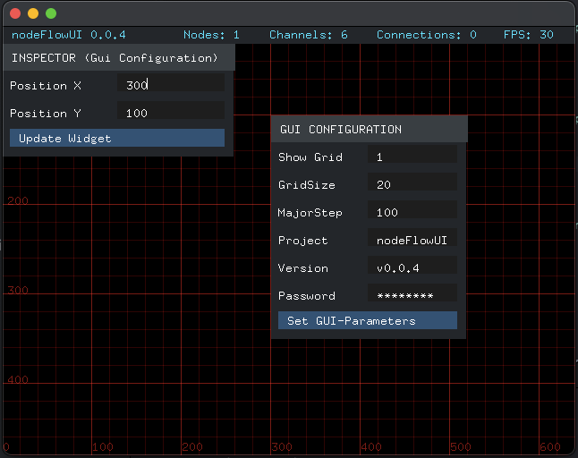
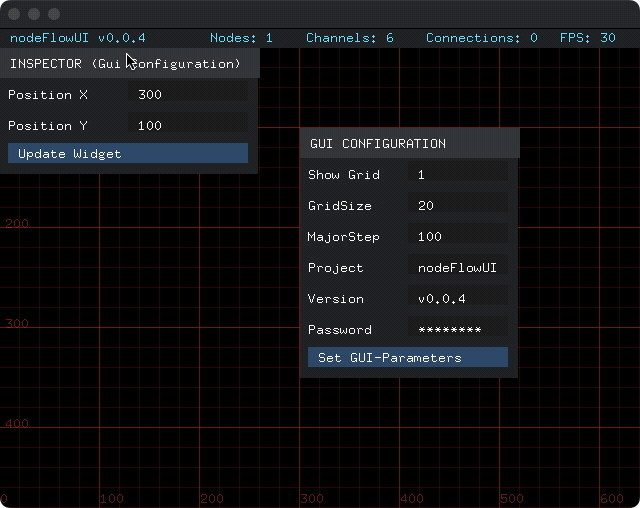
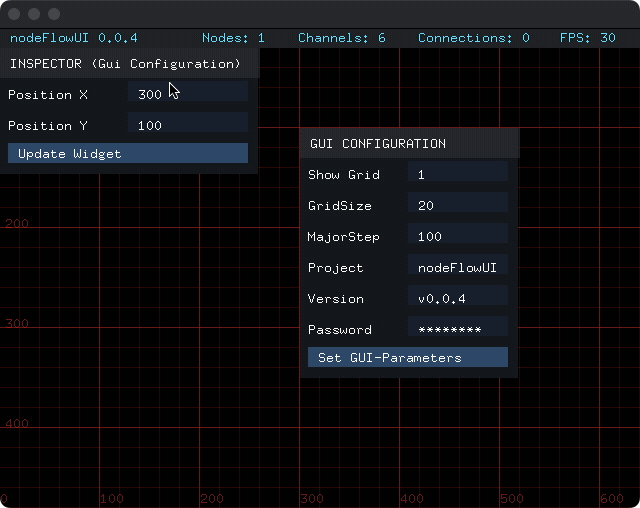

# nodeFlowUI v.0.0.4 - inspector



## In action - with alternate color scheme



## Text selection, copy & paste in action



# Demo UI

## Status Bar
- Text1
- Text2
- Hints - TODO add to config
- FPS - TODO add to config

## GUI Configuration Pannel

- Show Grid (Bool)
- Grid Size (Int)
- Major Step (Int)
- Status Text1 (String)
- Status Text2 (String)
- Password (String)
- Button (String)

## UI Components Inspector
### shows more details about the components

- switch visibility of UI components in the pannels
- define colors
- switch the type
- switch read only
- will need to be scrollable


# GUI Parameters

```(cpp)
class GUIParams {
public:
    
    GUIParams() :
        _showStatusBar(true),
        _statusBarHeight(30),
        _statusBarColor(ofColor::grey),
        _statusBarTextColor(ofColor::yellow),
        _showGrid(true),
        _gridSize(10),
        _majorStep(100),
        _majorGridColor(255),
        _minorGridColor(200),
        _scalingFactor(1.2f),
        _statusBarText1("nodeFlowUI"),
        _statusBarText2("vx.x.x")
    {}
    
    // Getter and setter for showStatusBar
    bool getShowStatusBar() const {
        return _showStatusBar;
    }

    void setShowStatusBar(bool show) {
        _showStatusBar = show;
    }

    // Getter and setter for statusBarHeight
    uint32_t getStatusBarHeight() const {
        return _statusBarHeight;
    }

    void setStatusBarHeight(uint32_t height) {
        _statusBarHeight = height;
    }

    // Getter and setter for statusBarColor
    const ofColor& getStatusBarColor() const {
        return _statusBarColor;
    }

    void setStatusBarColor(const ofColor& color) {
        _statusBarColor = color;
    }
    
    // Getter and setter for statusBarTextColor
    const ofColor& getStatusBarTextColor() const {
        return _statusBarTextColor;
    }

    void setStatusBarTextColor(const ofColor& color) {
        _statusBarTextColor = color;
    }
    
    // Getter and setter for showGrid
    bool getShowGrid() const {
        return _showGrid;
    }
    
    void setShowGrid(bool show) {
        _showGrid = show;
    }
    
    // Getter and setter for gridSize
    uint32_t getGridSize() const {
        return _gridSize;
    }
    
    void setGridSize(uint32_t size) {
        _gridSize = size;
    }
    
    // Getter and setter for majorStep
    uint32_t getMajorStep() const {
        return _majorStep;
    }
    
    void setMajorStep(uint32_t size) {
        _majorStep = size;
    }
    
    
    // Getter and setter for gridColor
    const ofColor& getMajorGridColor() const {
        return _majorGridColor;
    }
    
    void setMajorGridColor(const ofColor& color) {
        _majorGridColor = color;
    }
    
    const ofColor& getMinorGridColor() const {
        return _minorGridColor;
    }
    
    void setMinorGridColor(const ofColor& color) {
        _minorGridColor = color;
    }
    
    // Getter and setter for scalingFactor
    const double getScalingFactor() const {
        return _scalingFactor;
    }
    
    void setScalingFactor(const double& scalingFactor) {
        _scalingFactor = scalingFactor;
    }
    
    // Getter and setter for StatusbarTexts
    const std::string& getStatusBarText1() const {
        return _statusBarText1;
    }
    
    void setStatusBarText1(const std::string& statusBarText) {
        _statusBarText1 = statusBarText;
    }

    const std::string& getStatusBarText2() const {
        return _statusBarText2;
    }
    
    void setStatusBarText2(const std::string& statusBarText) {
        _statusBarText2 = statusBarText;
    }
    

    // Statusbar parameters
    bool _showStatusBar;
    uint32_t _statusBarHeight;
    ofColor _statusBarColor;
    ofColor _statusBarTextColor;
    std::string _statusBarText1;
    std::string _statusBarText2;
    
    // Grid parameters
    bool _showGrid;
    uint32_t _gridSize;
    uint32_t _majorStep;
    ofColor _majorGridColor;
    ofColor _minorGridColor;
    double _scalingFactor;
    
};
```

## Event handlers for GUI

- Key: F1 -> toggle grid display
- Key: F2 -> toggle StatusBar display
- Button Set GUI-Parameters -> update GUI Parameters
- Button Set Inspector-Parameters -> update GUI configuration pannel position


# Supported UI Elements 

## NfDom
### to create an elelement

## NfPannel
### TODO
- make it dragable

## NfLabel
### TODO
- make it dragable


## NfTextInputField
- respect input type (string, double, int, bool ...) when entering text
- added checking of maxTextLength 
- display asterisks for password input
### TODO
- make copy & paste work again
- isReadonly
- add the multiline feature
- implement rendering of text selection colors (text, selection)
- add type hint (optional)
- tab handler (optiona)

## NfButton
### TODO
- focus onMouseover (instead of click and release)

# Upcoming UI Elements

## NfToggleSwitch
### can toggle two states of a Type

## NfColorPicker
### TODO

## NfCommandLine
### TODO


## UI Element Properties
### implemeted a DOM like representation
```(cpp)
private:
    std::unique_ptr<NFValue> value; // Smart pointer to NFValue
public:
ofParameterGroup parameters;
ofParameter<ofColor> backgroundColor;
ofParameter<ofColor> textColor;
ofParameter<ofColor> borderColor;
ofParameter<ofColor> focusColor;
ofParameter<ofColor> focusBackgroundColor;
Offsets padding;
Offsets margin;
ofParameter<float> borderSize;
ofParameter<float> width;
ofParameter<float> height;
ofParameter<float> minWidth;
ofParameter<float> minHeight;
ofParameter<float> maxWidth;
ofParameter<float> maxHeight;
ofParameter<bool> isFocused;
ofParameter<bool> isVisible;
ofParameter<uint32_t> maxTextLength;
std::string text;
ofParameter<bool> textIsPassword;
ofRectangle bounds;
```

## Offsets
```(cpp)
ofParameterGroup parameters;
ofParameter<float> top;
ofParameter<float> right;
ofParameter<float> bottom;
ofParameter<float> left;
```

### TODO
- implement configuration of text selection color
- in inspect view render margins and paddings like in a browser inspect view


## Boxxer - the box rendering engine
### TODO
- fix rendering glitches (margin on first element)
- horizontal rendering
- UI manager for setting absolute coordinates for root-UI elements
- borders for all elements


# Features Roadmap

## GUI event display animation
## Examples: Text-Adventure layout (Image pannel & TextInput)

# Changelog

- 0.0.1 f0001-textinput: basic text input
- 0.0.2 f0002-button: buttons, configuration, statusbar
- 0.0.3 f0003-boxxer: a simple box rendering engine
- 0.0.4 f0004-inspector: 
  - added a nodemanager
  - a property inspector widget for nodes
  - button hover colors (text & background)
  - label hover colors (text & background)
  - pannel hover colors (text & background)
  - text input focus color (background)
  - added demo animation to /docs and README.md

