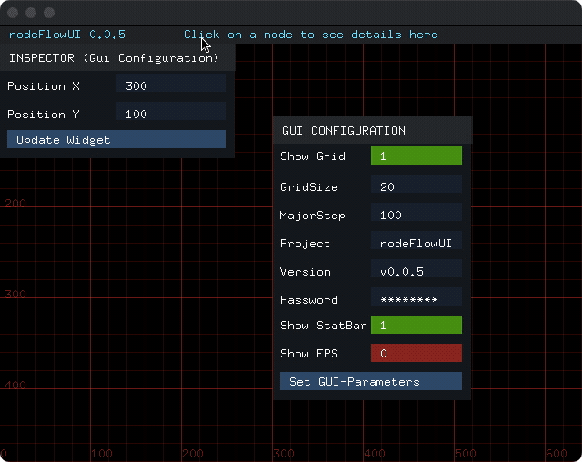

# nodeFlowUI


A modern, component-based UI framework for automation systems and standalone applications. Built on OpenFrameworks, nodeFlowUI provides a flexible, stylish interface system with an event-driven architecture.

## See it in action 



## What is nodeFlowUI?

nodeFlowUI is a modern C++ UI framework designed for both:
- Integration with the nodeFlow automation framework
- Development of standalone UI applications

With a focus on flexibility, component reusability, and a modern design aesthetic, nodeFlowUI gives developers the tools to create intuitive interfaces with minimal effort.

## Core Features

- 🧩 **Component Architecture**: Modular, reusable UI components
- 🎨 **Styling System**: Comprehensive styling options with dynamic theming
- 🔄 **Event Management**: Sophisticated event handling with bubbling and focus tracking
- 📦 **Box Model**: Intuitive layout engine inspired by web standards
- 🔍 **Inspector Tools**: Built-in component inspection capabilities

## Architecture

nodeFlowUI is built on several core concepts:

### Box Model (`NfBoxxer`)

The foundation of all UI components, providing:
- Layout management with margin and padding
- Hierarchical rendering
- Coordinate space transformation
- Debug visualization capabilities

### Value System (`NFValue`)

A type-safe value management system supporting:
- Multiple value types (String, Int, Double, Bool, Selection)
- Type conversion
- Observer pattern for change notification

### Event System

A comprehensive event management system featuring:
- Hierarchical event propagation
- Focus management
- Event recording and playback
- Global event bus

## Component Library

NfUIElement (Abstract Base Class)
  └── NfBoxxer (Primary Visual Component)
      ├── NfPanel
      ├── NfLabel
      ├── NfButton
      ├── NfToggleSwitch
      ├── NfTextInputField
      └── NfSelection

### Layout Components

#### `NfPanel`
Container for organizing UI elements with configurable:
- Background color
- Padding and margins
- Content dimensions

### Input Components

#### `NfButton`
Standard button component with:
- Click events
- Hover states
- Configurable colors and text

#### `NfTextInputField`
Text input component supporting:
- Different value types (string, int, double, bool)
- Password masking
- Text length limits
- Character validation
- Selection, Copy and Paste

#### `NfToggleSwitch`
Two-state toggle component for boolean values.

#### `NfSelection`
A modal Dropdown selection component for choosing from a list of options.

### Display Components

#### `NfLabel`
Text display component with configurable:
- Font (using OpenFrameworks font system)
- Colors and styling
- Alignment

### System Components

#### Status Bar
Application status display with:
- Project name display
- Version information
- Active node indication
- Optional FPS counter

#### Grid System
Visual design grid with:
- Configurable grid size
- Major/minor grid lines
- Toggle visibility

## Demo Application

The nodeFlowUI repository includes a demo application showcasing the framework's capabilities:

### GUI Configuration Panel
- Grid visibility toggle
- Grid size configuration
- Status bar settings
- Text input demonstration
- Password field example
- Dropdown selection

### UI Components Inspector
- Component position editing
- Visual property inspection
- Live updates

## Usage Example

```cpp
// Create a UI configuration
nfUI::NfUIConfig config;
config.backgroundColor = ofColor(22, 34, 51);
config.focusBackgroundColor = ofColor(13, 20, 30);
config.focusColor = ofColor::yellow;
config.bounds = ofRectangle(posX, posY, width, height);
config.setPadding(5, 10, 5, 10);
config.showLabel = true;

// Create a text input component
auto textInput = nfUI::createUIElement<nfUI::NfTextInputField, nfUI::StringNFValue>(
    config,
    "Username",    // Label
    ""             // Initial value
);

// Create a button
auto button = nfUI::createUIElement<nfUI::NfButton, nfUI::StringNFValue>(
    config,
    "Submit",      // Label
    "Submit"       // Button text
);

// Add event listener
ofAddListener(button->clicked, this, &MyApp::onButtonClicked);

// Add components to the node manager
nfUI::g_nodeManager.addNode(textInput);
nfUI::g_nodeManager.addNode(button);

// In your draw method
void draw() {
    nfUI::g_nodeManager.drawNodes();
}
```

## Event Handling

nodeFlowUI provides a comprehensive event system:

```cpp
// Key event handlers
void keyPressed(int key) {
    switch (key) {
        case OF_KEY_F1:
            // Toggle grid visibility
            _guiParams.setShowGrid(!_guiParams.getShowGrid());
            break;
        // ...other key handlers
    }
}

// Component event handlers
void onButtonClicked(nfUI::UIEventArgs& eventArgs) {
    // Handle button click
    std::cout << "Button clicked!" << std::endl;
}
```

## Upcoming Features

- 🎨 **NfColorPicker**: Color selection tool
- 🖥️ **NfCommandLine**: Command-line interface component
- 📜 **Scrollable Containers**: For handling overflow content

## Development Roadmap

- Performance stats for the rendering pipeline
- Enhanced theming capabilities
- Event recording and playback
- Read only Textfields
- Text-Adventure layout (Image panel & TextInput)

## Documentation

For version history and updates, see the [Changelog](CHANGELOG.md).

## Contributing

Contributions are welcome! See our contributing guidelines for details.

## License

nodeFlowUI is released under the MIT License.

This project is built on [OpenFrameworks](https://openframeworks.cc/), which is also released under the MIT License.
